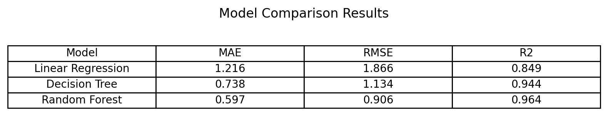

# Car Price Prediction (Regression) — CodeAlpha Task 3

## Project Goal
Build a machine learning regression model to predict **car selling price** using car features such as year, present price, kilometers driven, fuel type, seller type, transmission, and owner count.

## Dataset
- File: `data/raw/car data.csv`
- Rows: 301
- Columns: 9
- Missing values: None (all columns have 301 non-null values)

### Columns
- `Car_Name` (categorical)
- `Year` (numeric)
- `Selling_Price` (numeric) ✅ Target
- `Present_Price` (numeric)
- `Driven_kms` (numeric)
- `Fuel_Type` (categorical)
- `Selling_type` (categorical)
- `Transmission` (categorical)
- `Owner` (numeric)

## Project Structure
- `data/raw/` → original dataset (unchanged)
- `data/processed/` → cleaned/encoded dataset (created later)
- `notebooks/` → EDA + experiments
- `src/` → reusable code (preprocessing, training, evaluation)
- `models/` → saved trained models
- `reports/figures/` → plots and charts

## Workflow Plan
1. Load and inspect dataset
2. Exploratory Data Analysis (EDA)
3. Preprocessing and feature engineering
4. Train regression models
5. Evaluate using metrics (MAE, RMSE, R²)
6. Save best model and results

## Tools Used
Python, Pandas, NumPy, Scikit-learn, Matplotlib

## EDA Insights
- Selling price is right-skewed, with most cars priced in the lower range.
- Present price has a strong positive relationship with selling price.
- Cars with higher kilometers driven tend to have lower selling prices.
- Newer cars generally have higher selling prices.
- Owner count has a mild negative impact on selling price.

## Model Selection & Final Result

Three regression models were trained and evaluated:

- Linear Regression (baseline)
- Decision Tree Regressor
- Random Forest Regressor

### Why Random Forest was selected
- Lowest MAE (0.59) → most accurate predictions
- Lowest RMSE (0.91) → fewer large errors
- Highest R² (0.96) → explains 96% of price variance
- Ensemble method reduces overfitting compared to a single tree

The Random Forest Regressor was selected as the final model.

## Real-World Application
This project demonstrates how machine learning can support **used car price estimation** for:
- Online car resale platforms
- Car dealerships (trade-in pricing)
- Individuals estimating fair resale value

## How to Run a Prediction
After installing requirements, you can run:

python src/predict.py

## Model Comparison (Test Set)

